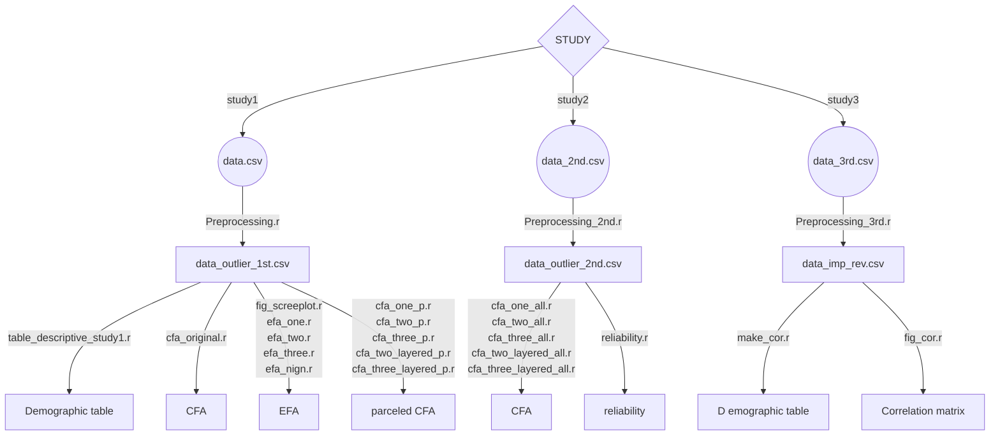

# Introduction
The Sustainable Development Goals (SDGs) are required to be achieved by 2030, and measurement indicators are needed to properly visualize individual efforts for SDGs.
Here, we developed a Japanese version of the Sustainability Consciousness Questionnaire (SCQ), the most well-known individual measure of the SDGs.
All data and analysis codes used in the creation of the Japanese version are uploaded to this GitHub repository.

「持続可能な開発目標（SDGs）」は，すべての国連加盟国で2030年までの達成が求められている，国際的に最も重要とされている共通課題です。
しかし日本においては，その取り組みを測定する個人指標が不在でした。
そこで，SDGsに関する個人指標として，世界的に最も著名である「Sustainability Consciousness Questionnaire (SCQ)」の日本語版を開発しました。

# The Japanese Version of Sustainability Consciousness Questionnaire
The Sustainability Consciousness Questionnaire's Japanese version (SCQ-J) is protected by copyright. However, it can be used without obtaining explicit permission.
To use it:
- Download the "SCQ-J.pdf" file. You can then utilize the questionnaire in its current format, suitable for marker-type responses.
- In case of any issues, please contant to Hiroyoshi Ogishima at "ogishima.hiroyoshi[at]kochi-tech.ac.jp (*Replace [at] with @)".
- If you use the scale in your work or publications, please cite the following reference.

日本語版Sustainability Consciousness Questionnaire（SCQ-J）は，著作権で保護されていますが，書面による許可申請なく，無償で使用することができます。
「SCQ-J.pdf」をダウンロードしていただければ，マーク式の質問紙として，そのまま使用いただけます。
何か問題がありましたらご連絡(ogishima.hiroyoshi[at]kochi-tech.ac.jp ※[at] = @)をいただけましたら幸いです。
尺度を利用された場合は，以下の引用をお願いいたします。

> Ogishima, H., Ito, A., Kajimura, S., & Himichi, T. (2023). Validity and reliability of the Japanese version of the sustainability consciousness questionnaire. *Frontiers in Psychology*, 14, 1130550.

# Data and Code Availability
All data and analysis codes used in the creation of the Japanese version are uploaded to this GitHub repository.
All analyses are performed by R3.2.1.
Please refer to the flowchart for details of each analysis file.

日本語版の開発にあたり使用したすべてのデータおよび分析コードは，すべてこのGitHubリポジトリにアップロードされています。
すべての分析は，R3.2.1によって行われています。
各解析ファイルの詳細については，フローチャートをご参照ください。

